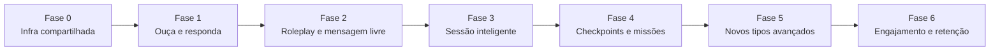

# Exercícios do Verbalize — Inventário e Habilidades

Documento de referência sobre **todos os formatos de exercício** implementados no projeto Verbalize (jun/2026). Cobre a prática das lições, revisão de vocabulário e sessões especiais.

**Seções:** [Inventário atual](#exercícios-da-prática-de-lições-32-tipos) · [Roadmap de evolução](#roadmap-de-evolução-plano-de-implementação) (ordem de implementação das melhorias)

> **Schema de lições cacheadas:** `PREGEN_SCHEMA_VERSION = 19` (jun/2026)

---

## Como ler este documento

Cada exercício indica quais **quatro habilidades** treina:

| Sigla | Habilidade | O que significa no Verbalize |
|-------|------------|------------------------------|
| **L** | Listening (compreensão auditiva) | Ouvir áudio/TTS e extrair informação |
| **S** | Speaking (produção oral) | Falar ou gravar voz |
| **R** | Reading (leitura) | Ler texto no idioma-alvo ou em PT-BR |
| **W** | Writing (escrita) | Digitar produção livre ou guiada |

**Intensidade:** ●●● forte · ●● moderado · ● leve · — não treina diretamente

---

## Visão geral do ecossistema

```text
Lição (5 exercícios aleatórios)
├── Gerados por IA (Gemini) — pool por tier de nível/vocabulário
├── Injetados no cliente — image-match (lições VOC com imagens)
└── Obrigatório — ≥1 exercício de produção por sessão

Revisão de vocabulário (SRS)
├── Flashcards
├── In Context (context-choice, reverse-translation, word-bank)
└── Visual (image-match)

Checkpoint / Mistake Review
└── Compreensão auditiva + listen-and-respond (produção oral)
```

### Tiers da pool aleatória (lições)

| Tier | Quando entra | Tipos |
|------|--------------|-------|
| **Tier 1** | Sempre (A1+) | sentence-builder, context-choice, speak-repeat, listening-comprehension, interactive-subtitles, scrambled-conversation, word-bank-translation |
| **Tier 2** | A1 com ≥30 palavras ou A2 com <60 palavras | + error-correction, social-roleplay, free-roleplay, micro-message, logic-connectors, bridge-choice, listen-and-select, reverse-translation, listen-and-respond, paraphrase, fill-gap-production, minimal-pair-production (A2+), shadowing (A2+), connected-speech (A2+), translation-with-constraint, inference-tone (B1+), story-continuation (B1+), spot-the-register (B1+), prompted-monologue (B1+) |
| **Tier 3** | A1 com ≥60 palavras ou A2+ | + audio-dictation, voicemail-dictation |

**Exclusivos por tag da lição** (sempre fixados no 1º slot quando aplicável):

| Tag | Exercício exclusivo |
|-----|---------------------|
| GRAM | grammar-trap |
| PRON | minimal-pair (A1) · minimal-pair-production (A2+) |
| VERB | conjugation-speed |

**Regras de composição da sessão:**
- 5 exercícios por lição (`PRACTICE_EXERCISE_COUNT`)
- Mínimo 3 tipos distintos; máximo 2 do mesmo tipo
- Pelo menos 1 exercício de **produção** (escrita, oral eco ou oral espontânea — ver `productionTypes.ts`)
- Lições **DIAL/MISS:** dupla produção (1 oral + 1 escrita) via `ensureDualProduction`
- Produção tende a ficar no **último slot** (receptivo → produção)
- **B1+:** `context-choice` e `conjugation-speed` saem do pool (exceto lições REVIEW e VERB)

---

## Exercícios da prática de lições (32 tipos)

### 1. Escolha contextual (`context-choice`)

**O que faz:** Apresenta uma frase original no idioma-alvo com lacuna (`___`). O aluno escolhe entre 4 opções plausíveis (mesma categoria gramatical, erros comuns ou grafias parecidas).

**Treina:**
| L | S | R | W |
|---|---|---|---|
| — | — | ●●● | — |

**Foco pedagógico:** Reconhecimento de vocabulário e gramática em contexto; distinção entre formas parecidas.

**Onde aparece:** Pool Tier 1 · Revisão "In Context"

---

### 2. Monte a frase (`sentence-builder`)

**O que faz:** Blocos de palavras embaralhados devem ser tocados na ordem correta para formar a frase. Inclui tradução PT-BR e explicação de ordem (ex.: posição do advérbio vs. português).

**Treina:**
| L | S | R | W |
|---|---|---|---|
| — | — | ●●● | ● |

**Foco pedagógico:** Sintaxe e ordem de palavras; construção mental de frases (produção guiada por blocos).

**Onde aparece:** Pool Tier 1

---

### 3. Associe a imagem (`image-match`)

**O que faz:** Mostra uma palavra no idioma-alvo; o aluno escolhe a imagem correta em grade 2×2 (Pexels). Distratores vêm de campos semânticos relacionados.

**Treina:**
| L | S | R | W |
|---|---|---|---|
| ● | — | ●● | — |

**Foco pedagógico:** Associação palavra ↔ conceito visual; vocabulário concreto.

**Onde aparece:** Injetado em lições **VOC** quando há imagens · Revisão "Visual" · *não* está no pool IA aleatório

---

### 4. Traduza livremente (`reverse-translation`)

**O que faz:** Frase em PT-BR → o aluno **digita** a tradução no idioma-alvo. Aceita variantes válidas; dica gramatical opcional.

**Treina:**
| L | S | R | W |
|---|---|---|---|
| — | — | ●● | ●●● |

**Foco pedagógico:** **Produção escrita livre** — o exercício mais próximo de uso real entre os tipos atuais. Obrigatório para A2+ ou ≥30 palavras conhecidas.

**Onde aparece:** Pool Tier 2 · Revisão "In Context" · Checkpoint (produção)

---

### 5. Banco de palavras (`word-bank-translation`)

**O que faz:** Frase em PT-BR → montar tradução tocando blocos de palavras na ordem certa (scaffolded production).

**Treina:**
| L | S | R | W |
|---|---|---|---|
| — | — | ●● | ●● |

**Foco pedagógico:** Produção guiada; ponte entre reconhecimento e tradução livre. Produção obrigatória para iniciantes (<15 palavras).

**Onde aparece:** Pool Tier 1 · Revisão "In Context"

---

### 6. Ditado (`audio-dictation`)

**O que faz:** Ouve uma frase curta via TTS e **digita** exatamente o que ouviu. Dica em PT-BR disponível.

**Treina:**
| L | S | R | W |
|---|---|---|---|
| ●●● | — | — | ●●● |

**Foco pedagógico:** Decodificação auditiva + ortografia; liga som à escrita.

**Onde aparece:** Pool Tier 3 (A2+ ou A1 avançado)

---

### 7. Fale e repita (`speak-repeat`)

**O que faz:** Ouve a frase, grava a voz imitando-a. Transcrição via API de fala; pontuação por similaridade de palavras (85% padrão, 90% em lições PRON). Pode pular se microfone indisponível.

**Treina:**
| L | S | R | W |
|---|---|---|---|
| ●● | ●●● | ● | — |

**Foco pedagógico:** Pronúncia, ritmo e produção oral **memorizada** (não espontânea). Produção oral obrigatória para vocabulário 15–29 com microfone.

**Onde aparece:** Pool Tier 1

---

### 8. Ouça e escolha (`listen-and-select`)

**O que faz:** Ouve uma frase via TTS **sem ver o texto** e escolhe a transcrição escrita correta entre 4 opções plausíveis.

**Treina:**
| L | S | R | W |
|---|---|---|---|
| ●●● | — | ●● | — |

**Foco pedagógico:** Discriminação auditiva fina (sons, liaisons, homófonos parciais).

**Onde aparece:** Pool Tier 2

---

### 9. Compreensão auditiva (`listening-comprehension`)

**O que faz:** Ouve um **diálogo original** de 3–5 falas (TTS multi-voz) **sem texto visível**. Responde pergunta de compreensão em PT-BR (significado, intenção, detalhe).

**Treina:**
| L | S | R | W |
|---|---|---|---|
| ●●● | — | ● | — |

**Foco pedagógico:** Compreensão de diálogo real; inferência de intenção — mais próximo de conversa real que listen-and-select.

**Onde aparece:** Pool Tier 1 · Checkpoints

---

### 10. Corrija o erro (`error-correction`)

**O que faz:** Frase com **um** erro deliberado. O aluno substitui a palavra errada ou reescreve a frase inteira (`replace` / `rewrite`). Explicação em PT-BR após resposta.

**Treina:**
| L | S | R | W |
|---|---|---|---|
| — | — | ●●● | ●● |

**Foco pedagógico:** Metalinguística; autocorreção gramatical.

**Onde aparece:** Pool Tier 2

---

### 11. Ponte PT-BR (`bridge-choice`)

**O que faz:** Cenário em PT-BR + pergunta sobre interferência do português. MCQ com 3–4 frases completas no idioma-alvo; explica o padrão de erro brasileiro.

**Treina:**
| L | S | R | W |
|---|---|---|---|
| — | — | ●●● | — |

**Foco pedagógico:** **Portuguese Bridge Method** — evitar tradução literal e falsos cognatos.

**Onde aparece:** Pool Tier 2

---

### 12. Diálogo real (`social-roleplay`)

**O que faz:** Contexto em PT-BR + fala do "NPC" no idioma-alvo. Escolhe a **melhor resposta** entre 3 opções plausíveis (não óbvias). Distratores são gramaticalmente corretos mas pragmaticamente inadequados.

**Treina:**
| L | S | R | W |
|---|---|---|---|
| ● | — | ●●● | — |

**Foco pedagógico:** Pragmática, registro (formal/informal), adequação situacional.

**Onde aparece:** Pool Tier 2

---

### 13. Ordem do diálogo (`scrambled-conversation`)

**O que faz:** 3–4 falas de diálogo embaralhadas; reorganizar na sequência lógica (alternância A→B, cumprimento→pergunta→resposta→despedida).

**Treina:**
| L | S | R | W |
|---|---|---|---|
| — | — | ●●● | — |

**Foco pedagógico:** Coerência discursiva; estrutura conversacional.

**Onde aparece:** Pool Tier 1

---

### 14. Legendas interativas (`interactive-subtitles`)

**O que faz:** Frase com 1–2 palavras erradas ou trocadas. Tocar nos erros e escolher a correção entre opções plausíveis.

**Treina:**
| L | S | R | W |
|---|---|---|---|
| — | — | ●●● | — |

**Foco pedagógico:** Leitura atenta; reconhecimento de formas incorretas (como revisar legendas de filme).

**Onde aparece:** Pool Tier 1

---

### 15. Conectores lógicos (`logic-connectors`)

**O que faz:** Duas partes de frase + escolha do conector correto (but, because, so, etc.) entre 3 opções.

**Treina:**
| L | S | R | W |
|---|---|---|---|
| — | — | ●●● | — |

**Foco pedagógico:** Coesão textual; relações lógicas entre ideias.

**Onde aparece:** Pool Tier 2

---

### 16. Radar de erro (`grammar-trap`)

**O que faz:** Cenário de interferência PT-BR. 4 frases no idioma-alvo — **apenas 1 correta**; as outras contêm erros clássicos de brasileiros. Exclusivo de lições **GRAM**.

**Treina:**
| L | S | R | W |
|---|---|---|---|
| — | — | ●●● | — |

**Foco pedagógico:** Identificação de armadilhas gramaticais; complementa o Bridge Quiz da lição (pode ser omitido se o quiz já foi aprovado).

**Onde aparece:** 1º slot em lições GRAM

---

### 17. Par mínimo (`minimal-pair`)

**O que faz:** Ouve dois sons/palavras parecidas (ex.: *poisson* vs *poison*). Escolhe qual se encaixa no contexto da frase. Dica de pronúncia em PT-BR. Exclusivo de lições **PRON**.

**Treina:**
| L | S | R | W |
|---|---|---|---|
| ●●● | ● | ●● | — |

**Foco pedagógico:** Discriminação fonética; sons que não existem em PT-BR.

**Onde aparece:** 1º slot em lições PRON

---

### 18. Conjugação rápida (`conjugation-speed`)

**O que faz:** Verbo + pronome + tempo → MCQ com 4 formas conjugadas plausíveis. Inclui frase-exemplo com a forma correta. Exclusivo de lições **VERB**.

**Treina:**
| L | S | R | W |
|---|---|---|---|
| ● | — | ●●● | — |

**Foco pedagógico:** Automatização de paradigmas verbais (reconhecimento rápido, não produção espontânea).

**Onde aparece:** 1º slot em lições VERB · excluído do pool B1+ (exceto REVIEW/VERB)

---

### 19. Ouça e responda (`listen-and-respond`) · Fase 1 ✅

**O que faz:** Ouve diálogo curto (3–4 falas) e **grava resposta oral espontânea** à pergunta/pedido final. Avaliação semântica (Gemini + fallback local).

**Treina:** L ●●● · S ●●● (espontâneo) · R ● · W —

**Onde aparece:** Tier 2 · DIAL/MISS · Checkpoint (produção oral)

---

### 20. Roleplay livre (`free-roleplay`) · Fase 2 ✅

**O que faz:** Contexto situacional + fala do NPC → aluno **digita** resposta livre (pragmática). Avaliação via `evaluateFreeResponse`.

**Treina:** L ● · R ●● · W ●●●

**Onde aparece:** Tier 2 · DIAL, MISS, EXPR

---

### 21. Mensagem rápida (`micro-message`) · Fase 2 ✅

**O que faz:** Cenário estilo chat/e-mail → aluno escreve 1–2 frases informais. Avaliação de registro e adequação.

**Treina:** R ●● · W ●●●

**Onde aparece:** Tier 2 · DIAL, MISS

---

### 22. Parafraseie (`paraphrase`) · Fase 5 P1 ✅

**O que faz:** Reescreve frase no idioma-alvo com **mesmo sentido, palavras diferentes**. Validação local de variantes.

**Treina:** R ●● · W ●●●

**Onde aparece:** Tier 2 · VOC, EXPR

---

### 23. Complete (produção) (`fill-gap-production`) · Fase 5 P1 ✅

**O que faz:** Frase com lacuna aberta — aluno **digita** a palavra (não MCQ). Evolução de `context-choice`.

**Treina:** R ●● · W ●●●

**Onde aparece:** Tier 2 · VOC, GRAM · substituto adaptativo quando vocabulário dominado

---

### 24. Par mínimo falado (`minimal-pair-production`) · Fase 5 P2 ✅

**O que faz:** Ouve par mínimo e **fala** a palavra correta (não escolhe). Mesmo schema de `minimal-pair`.

**Treina:** L ●●● · S ●●● · R ●●

**Onde aparece:** 1º slot PRON (A2+) · Tier 2 (A2+)

---

### 25. Shadowing (`shadowing`) · Fase 5 P2 ✅

**O que faz:** Ouve e **fala junto** com o áudio simultaneamente (V1: TTS + gravação; overlap de palavras).

**Treina:** L ●●● · S ●●● · R ●

**Onde aparece:** Tier 2 (A2+) · PRON

---

### 26. Traduza com restrição (`translation-with-constraint`) · Fase 5 P3 ✅

**O que faz:** Traduz PT→idioma-alvo incluindo **chunk obrigatório** da lição (`required_chunk`).

**Treina:** R ●● · W ●●●

**Onde aparece:** Tier 2 · VOC, EXPR, GRAM

---

### 27. Correio de voz (`voicemail-dictation`) · Fase 5 P3 ✅

**O que faz:** Ouve mensagem longa (2–4 frases) e escreve **resumo em português** (compreensão + síntese).

**Treina:** L ●●● · W ●● (PT-BR)

**Onde aparece:** Tier 3 · DIAL, MISS

---

### 28. Tom da fala (`inference-tone`) · Fase 5 P4 ✅

**O que faz:** Dois áudios contrastantes (atitudes/registros diferentes) → escolhe qual expressa o tom pedido (MCQ A/B).

**Treina:** L ●●● · R ●●

**Onde aparece:** Tier 2 (B1+) · DIAL, EXPR, CULT

---

### 29. Fala conectada (`connected-speech`) · Fase 5 P4 ✅

**O que faz:** Ouve frase com **liaison/elision** (FR) ou **linking** (EN), vê contraste segmentado→ligado, escreve a transcrição ortográfica padrão.

**Treina:** L ●●● · W ●● · R ●●

**Onde aparece:** Tier 2 (A2+) · PRON, listen-and-select adjacente

---

### 30. Continue a história (`story-continuation`) · Fase 5 P5 ✅

**O que faz:** Lê 2–3 frases de abertura narrativa → escreve **1–2 frases** continuando de forma coerente. Avaliação via `evaluateFreeResponse` (coerência discursiva, não cópia literal).

**Treina:** R ●● · W ●●● · S ● (fala opcional futura)

**Onde aparece:** Tier 2 (B1+) · DIAL, MISS

---

### 31. Registro errado (`spot-the-register`) · Fase 5 P5 ✅

**O que faz:** Diálogo curto com **uma fala de registro inadequado** (formal/informal, tu/vous…) → aluno **reescreve** a linha destacada mantendo a intenção. Avaliação via `evaluateFreeResponse`.

**Treina:** R ●●● · W ●●●

**Onde aparece:** Tier 2 (B1+) · CULT, EXPR, DIAL

---

### 32. Mini-monólogo (`prompted-monologue`) · Fase 5 P6 ✅

**O que faz:** Cenário + tema → aluno **fala por 30–60 segundos** (3–6 frases espontâneas). Avaliação via `evaluateFreeResponse` + transcrição de voz.

**Treina:** S ●●● · R ●●

**Onde aparece:** Tier 2 (B1+) · DIAL, MISS

---

## Modos de revisão de vocabulário (fora da pool de lições)

Estes formatos **não entram na roleta aleatória** das lições, mas usam tipos de exercício compartilhados ou mecânicas próprias.

### Flashcards

**O que faz:** Cartão com palavra/imagem; virar para ver tradução. Direção aleatória FR→PT ou PT→FR. Autoavaliação (lembrei / não lembrei) alimenta SRS.

**Treina:**
| L | S | R | W |
|---|---|---|---|
| ● | — | ●● | — |

---

### Revisão In Context

**O que faz:** Sessão SRS com exercícios IA dos tipos `context-choice`, `reverse-translation` e `word-bank-translation` sobre palavras vencidas.

**Treina:** Mesmas habilidades dos tipos correspondentes, aplicadas à retenção de vocabulário.

---

### Revisão Visual

**O que faz:** Sessão SRS exclusivamente com `image-match` das palavras da sessão.

**Treina:** Leitura + associação visual (ver tipo 3).

---

## Matriz resumida — habilidades por tipo

| Exercício | L | S | R | W | Produção? |
|-----------|---|---|---|---|-----------|
| context-choice | — | — | ●●● | — | Não |
| sentence-builder | — | — | ●●● | ● | Não |
| image-match | ● | — | ●● | — | Não |
| reverse-translation | — | — | ●● | ●●● | **Sim** |
| word-bank-translation | — | — | ●● | ●● | **Sim** |
| audio-dictation | ●●● | — | — | ●●● | **Sim** |
| speak-repeat | ●● | ●●● | ● | — | **Sim** |
| listen-and-select | ●●● | — | ●● | — | Não |
| listening-comprehension | ●●● | — | ● | — | Não |
| error-correction | — | — | ●●● | ●● | Não |
| bridge-choice | — | — | ●●● | — | Não |
| social-roleplay | ● | — | ●●● | — | Não |
| scrambled-conversation | — | — | ●●● | — | Não |
| interactive-subtitles | — | — | ●●● | — | Não |
| logic-connectors | — | — | ●●● | — | Não |
| grammar-trap | — | — | ●●● | — | Não |
| minimal-pair | ●●● | ● | ●● | — | Não |
| conjugation-speed | ● | — | ●●● | — | Não |
| listen-and-respond | ●●● | ●●● | ● | — | **Sim** (oral espontâneo) |
| free-roleplay | ● | — | ●● | ●●● | **Sim** (pragmático) |
| micro-message | — | — | ●● | ●●● | **Sim** (pragmático) |
| paraphrase | — | — | ●● | ●●● | **Sim** |
| fill-gap-production | — | — | ●● | ●●● | **Sim** |
| minimal-pair-production | ●●● | ●●● | ●● | — | **Sim** (oral eco) |
| shadowing | ●●● | ●●● | ● | — | **Sim** (oral eco) |
| translation-with-constraint | — | — | ●● | ●●● | **Sim** |
| voicemail-dictation | ●●● | — | ● | ●● | **Sim** (resumo PT) |
| inference-tone | ●●● | — | ●● | — | Não |
| connected-speech | ●●● | — | ●● | ●● | **Sim** |
| story-continuation | — | ● | ●● | ●●● | **Sim** (narrativa livre) |
| spot-the-register | — | — | ●●● | ●●● | **Sim** (pragmática) |
| prompted-monologue | — | ●●● | ●● | — | **Sim** (oral espontâneo) |

**Evolução desde jun/2026:** a pool passou de ~4 tipos de produção para **16 tipos de produção** (eco, espontânea oral/escrita, pragmática e narrativa). Sessões DIAL/MISS exigem oral + escrita. Engajamento: 2 tentativas (reconhecimento), botão "Por que funciona?", streak semanal de produção.

---

## Roadmap de evolução (plano de implementação)

> **Objetivo:** aumentar produção espontânea (fala e escrita), ancorar exercícios em situações reais e melhorar retenção — sem perder o que já funciona para A1.
>
> **Última revisão do plano:** jun/2026 · **Fases 0–6 concluídas** · **Fase 5 concluída** (P1–P6 ✅)

### Princípios de priorização

1. **Reutilizar infra existente** antes de criar tipos novos (`evaluateFreeResponse`, `useVoiceRecorder`, `ListeningComprehensionExercise`, `MissionRolePlay`).
2. **Impacto em fluência** antes de polish de UI.
3. **Entregas incrementais** — cada fase deve funcionar isoladamente em produção.
4. **Zero-custo** — Gemini Flash + TTS existente; evitar APIs pagas novas.
5. **Não regredir A1** — MCQ e blocos permanecem no Tier 1; produção espontânea entra por tier/nível.

### Visão das fases



| Fase | Nome | Duração estimada | Impacto principal |
|------|------|------------------|-------------------|
| **0** | Infra compartilhada | 3–5 dias | Base para avaliação semântica oral/escrita | ✅ |
| **1** | `listen-and-respond` | 4–6 dias | **Speaking espontâneo** na pool de lições | ✅ |
| **2** | Roleplay e micro-mensagem | 5–7 dias | Writing + pragmática em produção livre | ✅ |
| **3** | Composição inteligente da sessão | 4–6 dias | Retenção e transferência entre lições | ✅ |
| **4** | Checkpoints e missões | 3–5 dias | Uso real em arcos narrativos | ✅ |
| **5** | Tipos avançados (backlog) | contínuo | Listening/speaking de alto nível | ✅ |
| **6** | Engajamento e feedback | 3–4 dias | Motivação e metacognição | ✅ |

---

### Fase 0 — Infra compartilhada de produção

**Meta:** unificar avaliação de respostas livres (oral e escrita) antes de criar novos tipos.

| # | Entrega | Descrição | Arquivos-chave |
|---|---------|-----------|----------------|
| 0.1 | `evaluateFreeResponse` v2 | Hoje é heurística local (`similarity` + keywords). Adicionar **Gemini Flash** como avaliador semântico (adequação pragmática, gramática tolerante, feedback PT-BR). Manter fallback local offline/rate-limit. | `app/actions/evaluateFreeResponse.ts`, `services/gemini.ts` |
| 0.2 | `OralProductionExercise` shell | Componente reutilizável: gravar → transcrever → avaliar → feedback. Extrair padrão de `SpeakRepeatExercise` + `UserTurn` (mission-roleplay). | `components/lesson/OralProductionShell.tsx` (novo), `hooks/useOralProduction.ts` (novo) |
| 0.3 | Extensão de `productionTypes` | Novos tipos espontâneos contam como produção: `listen-and-respond`, `free-roleplay`, `micro-message`. Tier `oral_spontaneous` vs `oral_echo` (`speak-repeat`). | `lib/practiceExercises/productionTypes.ts` |
| 0.4 | Schema bump | `PREGEN_SCHEMA_VERSION` + validação em `validateGeneratedExercises.ts` para novos tipos. | `lib/practiceExercises/constants.ts`, `validateGeneratedExercises.ts` |

**Critério de pronto:** action de avaliação retorna `{ isCorrect, feedback, correctedSentence }` com testes unitários; shell grava e avalia frase dummy.

**Dependências:** nenhuma (base de tudo).

---

### Fase 1 — `listen-and-respond` (Ouça e responda)

**Meta:** primeiro exercício de **speaking espontâneo** na pool aleatória — a ideia que você sugeriu.

**Mecânica:**
1. TTS reproduz diálogo curto (3–4 falas) — reutiliza pipeline de `listening-comprehension`.
2. NPC faz pergunta ou pedido na última fala.
3. Aluno **grava resposta oral** (não repete texto).
4. Gemini avalia adequação (não match literal).

| # | Entrega | Detalhe |
|---|---------|---------|
| 1.1 | Tipo + dados | `ListenAndRespondData`: `dialogueAudio`, `promptLine`, `contextPt`, `evaluationCriteria`, `acceptableThemes[]`, `exampleResponse` |
| 1.2 | Prompt Gemini | Em `exerciseTypeDescriptions.ts` + regras em `promptBuilder.ts` |
| 1.3 | Componente UI | `ListenAndRespondExercise.tsx` — áudio + `OralProductionShell` |
| 1.4 | Pool e tiers | Tier 2 (A1 ≥30 palavras); **prioridade em tags `DIAL` e `MISS`** via `tagGuidance.ts` |
| 1.5 | Meta e imersão | `exerciseTypeMeta.ts`, `EXERCISE_INSTRUCTIONS_TARGET` |
| 1.6 | Stats | `incrementProductionStats(user, 'oralSpontaneous', …)` |

**Critério de pronto:** lição DIAL sorteia o tipo; gravação funciona; feedback explica por que a resposta foi adequada ou não.

**Dependências:** Fase 0.

---

### Fase 2 — Produção escrita/pragmática livre

**Meta:** evoluir reconhecimento pragmático para **produção real**.

#### 2A — `free-roleplay` (evolução de `social-roleplay`)

| Aspecto | Hoje (`social-roleplay`) | Depois (`free-roleplay`) |
|---------|--------------------------|--------------------------|
| Resposta | MCQ (3 opções) | Texto livre ou voz |
| Avaliação | `correctIndex` | `evaluateFreeResponse` / Gemini |
| Fallback | — | MCQ se aluno preferir modo guiado |

**Implementação:** modo `productionMode: 'choice' | 'free'` no mesmo tipo, ou tipo novo. Recomendado: **tipo novo** para não quebrar lições cacheadas.

#### 2B — `micro-message`

**Mecânica:** contexto estilo WhatsApp/e-mail informal; aluno escreve 1–2 frases; validação local + Gemini para registro informal.

| # | Entrega | Tier sugerido |
|---|---------|---------------|
| 2.1 | `free-roleplay` completo | Tier 2 · tags DIAL, MISS, EXPR |
| 2.2 | `micro-message` | Tier 2 · tags DIAL, MISS |
| 2.3 | Remover dica em `reverse-translation` | A2+ (`hint` omitido no prompt quando `level >= A2`) |
| 2.4 | Escada de produção escrita | SRS domínio alto → forçar `reverse-translation` em vez de `word-bank` em `resolveRequiredProductionType` |

**Critério de pronto:** sessão pode ter roleplay livre digitado; micro-mensagem validada por registro.

**Dependências:** Fase 0 (avaliação). Fase 1 opcional (oral no roleplay reutiliza shell).

---

### Fase 3 — Composição inteligente da sessão

**Meta:** melhorar **retenção e transferência** sem novos tipos (só orquestração).

| # | Entrega | Descrição | Arquivos-chave |
|---|---------|-----------|----------------|
| 3.1 | **Dupla produção** em DIAL/MISS | Exigir 1 oral + 1 escrita por sessão (ou 2 produções quando `PRACTICE_EXERCISE_COUNT` subir para 6). | `dualProduction.ts`, `productionTypes.ts` | ✅ |
| 3.2 | **Encadeamento** (chained drills) | Mesmo chunk/frase: `listening-comprehension` → `reverse-translation` ou `listen-and-respond`. Flag `linkedExerciseId` no JSON gerado. | `chainExercises.ts`, `sessionComposition.ts` | ✅ |
| 3.3 | **Interleaving** | Prompt inclui 2–3 palavras de lições anteriores (`knownVocabulary` já existe). | `interleaving.ts`, `promptBuilder.ts` | ✅ |
| 3.4 | **Tier-down adaptativo** | SRS ≥4: `context-choice`/`sentence-builder` sobre palavra dominada → produção. Na geração (`sessionComposition.ts`) **e ao carregar cache** (`useLessonFlow.ts`). | `adaptiveTier.ts` | ✅ |
| 3.5 | Ancoragem no diálogo | Todo exercício referencia trecho do hook (já parcial); reforçar no prompt: "use vocabulary from dialogue, do not copy sentences". | `buildDialogueAnchorBlock()` em `promptBuilder.ts` | ✅ |

**Critério de pronto:** sessão DIAL tem 2 produções; pelo menos 1 par encadeado funciona.

**Dependências:** Fases 1–2 para dupla produção oral+escrita.

---

### Fase 4 — Checkpoints e missões

**Meta:** levar produção espontânea para **arcos narrativos** (onde o usuário já espera simulação real).

| # | Entrega | Descrição | Status |
|---|---------|-----------|--------|
| 4.1 | Checkpoint: turno oral | Após compreensão auditiva, 1× `listen-and-respond` | ✅ |
| 4.2 | Mission roleplay: Gemini eval | `evaluateFreeResponse` + `preferGemini: true` quando `intentMode=true` (B1+ MISS) | ✅ |
| 4.3 | Consequência narrativa leve | `rolePlayConsequences` no hook → tom do NPC muda após resposta inadequada | ✅ |
| 4.4 | Stats visíveis | Tela pós-lição: `ProductionWeekStat` — frases produzidas na semana | ✅ |

**Dependências:** Fases 0–1.

---

### Fase 5 — Backlog de novos tipos (prioridade dentro da fase)

Tipos novos **após** as fases 0–4 estabilizarem a infra.

| Prioridade | ID | Nome | L/S/R/W | Esforço | Status |
|------------|-----|------|---------|---------|--------|
| P1 | `paraphrase` | Parafraseie | S/W | Médio | ✅ |
| P1 | `fill-gap-production` | Complete (produção) | W | Baixo | ✅ |
| P2 | `shadowing` | Shadowing | L/S | Médio | ✅ |
| P2 | `minimal-pair-production` | Par mínimo falado | L/S | Baixo | ✅ |
| P3 | `translation-with-constraint` | Traduza com restrição | W | Baixo | ✅ |
| P3 | `voicemail-dictation` | Correio de voz | L/W | Médio | ✅ |
| P4 | `inference-tone` | Tom da fala | L/R | Médio | ✅ |
| P4 | `connected-speech` | Fala conectada | L/W | Alto | ✅ |
| P5 | `story-continuation` | Continue a história | S/W | Médio | ✅ |
| P5 | `spot-the-register` | Registro errado | R/W | Médio | ✅ |
| P6 | `prompted-monologue` | Mini-monólogo | S | Alto | ✅ |

---

### Fase 6 — Engajamento, dificuldade desejável e metacognição

**Meta:** tornar a prática mais **memorable** sem gamificação vazia.

| # | Entrega | Descrição |
|---|---------|-----------|
| 6.1 | **2 tentativas** antes do gabarito | `desirableDifficulty.ts` — por tipo (não em produção oral livre) | ✅ |
| 6.2 | **Elaboração** pós-acerto | Botão "Por que funciona?" → dica local PT-BR | ✅ |
| 6.3 | **Streak de produção** | Badge semanal ≥3 frases (`ProductionWeekStat`) | ✅ |
| 6.4 | Reduzir MCQ em B1+ | Exclui `context-choice` e `conjugation-speed` (exceto REVIEW/VERB) | ✅ |

**Dependências:** Fases 1–3 (para distinguir produção espontânea).

---

### Fase 7 — Observabilidade e métricas de produção

**Meta:** medir se o roadmap está funcionando na prática — eco vs espontânea, semanal e por sessão DIAL/MISS.

| # | Entrega | Descrição | Status |
|---|---------|-----------|--------|
| 7.1 | Invalidação pregen stale | `isPregenSchemaCurrent()` — `schemaVersion` ausente = v0; exercícios stale regeneram na lição; pregen em background pode sobrescrever cache antigo | ✅ |
| 7.2 | Breakdown eco / espontânea / escrita | `weeklyOralSpontaneousAccepted` no Firestore; `getWeeklyProductionBreakdown()` deriva `oralEcho`; badges em `ProductionWeekStat` e `ProfileHero` | ✅ |
| 7.3 | Dashboard — produção semanal | `DashboardProductionCard` — badges + barra meta 3 falas espontâneas/semana (`SPONTANEOUS_ORAL_WEEKLY_GOAL`) | ✅ |
| 7.4 | Métrica sessão DIAL/MISS | `lesson_logs`: `lessonTag`, `hadSpontaneousProductionAccepted`; flag de sessão via `sessionProductionTracking.ts`; taxa 7 dias no dashboard (meta 40%) | ✅ |
| 7.5 | Testes smoke | `test-production-stats.ts` (breakdown + schema pregen + taxa de sessão); `test-adaptive-tier.ts`; `test-vocab-retention.ts`; `test-review-session.ts` | ✅ |
| 7.6 | Taxa conclusão oral | `oralExerciseCompleted` / `oralExerciseSkipped`; `recordOralExerciseOutcome()` em todos os fluxos orais; meta 70% no dashboard | ✅ |
| 7.7 | Retenção SRS produzida vs passiva | `markVocabularyProduced()` ao acertar produção; `computeVocabRetentionComparison()` no dashboard; meta +15% intervalo médio | ✅ |

**Dependências:** Fases 0–6 (contadores `oralSpontaneous`, tipos espontâneos na pool).

---

### Fase 8 — Retenção ativa na revisão SRS

**Meta:** usar `productionCount` para **agir**, não só medir — palavras só reconhecidas entram mais na revisão e recebem exercícios de produção.

| # | Entrega | Descrição | Status |
|---|---------|-----------|--------|
| 8.1 | Prioridade passive-only na fila | `pickReviewSession()` — peso 3× para palavras sem produção; chips destacados na fila | ✅ |
| 8.2 | Produção na revisão "Em contexto" | `pickReviewType()` — passive-only → `reverse-translation` / `word-bank`; acerto marca `markVocabularyProduced()` | ✅ |

**Dependências:** Fase 7.7 (`productionCount`, `knowledgeMode`).

---

### Ordem de execução recomendada (sprint a sprint)

```text
Sprint 1–5  → Fases 0–4 ✅
Sprint 6    → Fase 5 P1 ✅
Sprint 7    → Fase 5 P2–P3 + Fase 6 ✅
Sprint 8    → Fase 5 P4 (inference-tone, connected-speech) ✅
Sprint 9    → Fase 5 P5 (story-continuation) ✅
Sprint 10   → Fase 5 P5 (spot-the-register) ✅
Sprint 11   → Fase 5 P6 (prompted-monologue) ✅ · **Fase 5 completa**
Sprint 12   → Fase 7.1–7.2 (pregen stale + breakdown eco/espontânea) ✅
Sprint 13   → Fase 7.3–7.4 (dashboard produção + métrica sessão DIAL/MISS) ✅
Sprint 14   → Fase 7.5 (testes smoke) ✅
Sprint 15   → Fase 7.6 (taxa conclusão oral vs skip) ✅
Sprint 16   → Fase 7.7 (retenção SRS produzida vs passiva) ✅ · **Observabilidade completa**
Sprint 17   → Fase 8.1–8.2 (revisão SRS prioriza passive-only + produção) ✅
```

### Métricas de sucesso

| Métrica | Baseline | Meta | Instrumentação |
|---------|----------|------|----------------|
| % sessões DIAL/MISS com produção espontânea aceita | ~0% | ≥40% | ✅ `getRecentSpontaneousSessionStats` · `DashboardProductionCard` |
| Exercícios orais espontâneos aceitos / usuário / semana | 0 | ≥3 | ✅ `weeklyOralSpontaneousAccepted` · barra no dashboard |
| Taxa de conclusão de exercício oral | — | ≥70% (vs skip por mic) | ✅ `oralExerciseCompleted` / `oralExerciseSkipped` · dashboard |
| Retenção SRS palavras produzidas vs só MCQ | — | +15% intervalo médio | ✅ `productionCount` / `computeVocabRetentionComparison` · dashboard |

### Riscos e mitigações

| Risco | Mitigação |
|-------|-----------|
| Latência Gemini na avaliação oral | Feedback imediato "analisando…"; cache de critérios; fallback local |
| Microfone indisponível | Fallback escrito (`free-roleplay` modo texto) — padrão já usado em mission-roleplay |
| Custo API | Gemini Flash only; avaliar só produção, não receptivos |
| Lições cacheadas no Firestore | `PREGEN_SCHEMA_VERSION` (19); `isPregenSchemaCurrent()` trata `schemaVersion` ausente como stale; `useLessonBootstrap` regenera exercícios; `useDashboardPregen` refaz pregen em background |
| Qualidade da avaliação semântica | `exampleResponse` + `acceptableThemes` no JSON; testes com 20 respostas reais |

### Checklist por novo tipo de exercício

Ao implementar qualquer tipo da Fase 5, seguir esta ordem (padrão do projeto):

- [ ] `types/index.ts` — `ExerciseType` + interface `*Data`
- [ ] `lib/exerciseTypeMeta.ts` — título, instrução, ícone, variant
- [ ] `lib/immersion.ts` — instruções no idioma-alvo (se aplicável)
- [ ] `lib/practiceExercises/exerciseTypeDescriptions.ts` — prompt Gemini
- [ ] `lib/practiceExercises/constants.ts` — tier e elegibilidade
- [ ] `lib/practiceExercises/tagGuidance.ts` — preferência por tag
- [ ] `lib/practiceExercises/validateGeneratedExercises.ts` — schema
- [ ] `lib/practiceExercises/productionTypes.ts` — se for produção
- [ ] `components/lesson/*Exercise.tsx` — UI
- [ ] `components/lesson/LessonPracticeScreen.tsx` — switch case
- [ ] `app/actions/explainWrongAnswer.ts` — explicação de erro
- [ ] `docs/exercicios-verbalize.md` — inventário atualizado

---

## Referências no código

| Arquivo | Conteúdo |
|---------|----------|
| `types/index.ts` | Union `ExerciseType` e interfaces de dados |
| `lib/exerciseTypeMeta.ts` | Títulos, instruções e variantes visuais |
| `lib/practiceExercises/constants.ts` | Tiers e regras de elegibilidade |
| `lib/practiceExercises/productionTypes.ts` | Tipos de produção e regras obrigatórias |
| `lib/practiceExercises/exerciseTypeDescriptions.ts` | Prompts Gemini por tipo |
| `lib/practiceExercises/desirableDifficulty.ts` | 2 tentativas antes do gabarito (por tipo) |
| `lib/elaborationHints.ts` | Dicas locais pós-acerto ("Por que funciona?") |
| `lib/practiceExercises/adaptiveTier.ts` | Upgrade reconhecimento→produção para vocabulário dominado (SRS ≥4) |
| `lib/practiceExercises/sessionComposition.ts` | Pipeline pós-Gemini (variety, produção, chains) |
| `utils/assemblePracticeExercises.ts` | Montagem final da sessão |
| `components/lesson/LessonPracticeScreen.tsx` | Renderização de todos os tipos |
| `app/actions/evaluateFreeResponse.ts` | Avaliação de resposta oral livre (mission-roleplay; base da Fase 0) |
| `hooks/useMissionRolePlay.ts` | Diálogo interativo com produção oral (lições MISS) |
| `lib/productionStatsHelpers.ts` | Breakdown semanal/cumulativo; taxa de sessão DIAL/MISS |
| `lib/sessionProductionTracking.ts` | Marca produção espontânea aceita na sessão atual |
| `lib/practiceExercises/constants.ts` | `isPregenSchemaCurrent()` — invalidação de cache pregen |
| `components/dashboard/DashboardProductionCard.tsx` | Produção semanal + meta espontânea + taxa DIAL/MISS (7 dias) |
| `components/profile/ProfileHero.tsx` | Breakdown de produção no perfil |
| `hooks/useDashboardPregen.ts` | Pregen em background; detecta cache stale por schema |
| `app/(app)/lesson/hooks/useLessonBootstrap.ts` | Cache pregen; exercícios stale regeneram na hora |
| `lib/oralExerciseTracking.ts` | Registra concluído vs skip em exercícios orais |
| `lib/vocabRetentionStats.ts` | Compara intervalo SRS: vocabulário produzido vs passivo |
| `lib/vocabKnowledgeMode.ts` | `isVocabularyProduced` / `isPassiveOnlyVocabulary` |
| `utils/reviewSession.ts` | Seleção weighted da fila de revisão (passive-first) |
| `lib/vocabProductionTracking.ts` | Marca vocabulário da lição após produção aceita |
| `lib/vocabProductionWords.ts` | Extrai palavras-alvo de exercícios de produção |
| `services/firestore.ts` | `incrementOralExerciseOutcome`, stats de produção |
| `test-production-stats.ts` | Smoke tests de stats e schema pregen |
